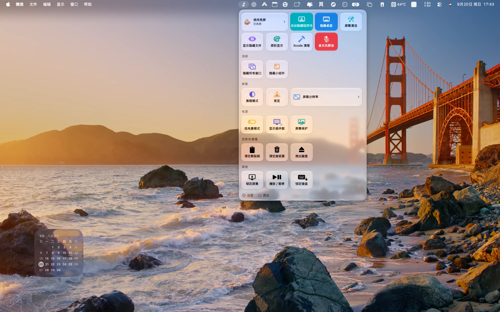
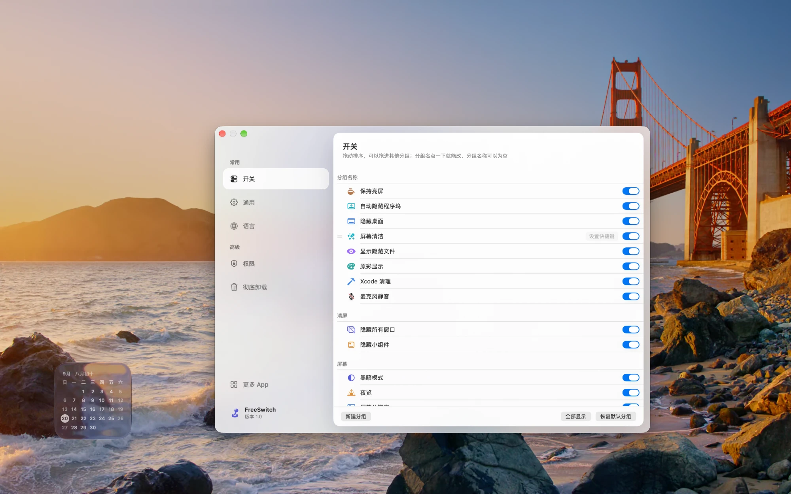
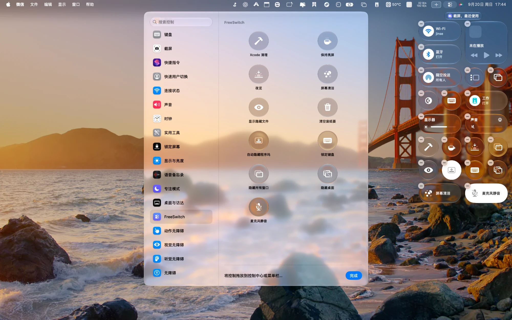

# FreeSwitch

[简体中文](README.md) · **English**

## ⬇︎ [Download FreeSwitch](https://home.astrocean.love/apps/freeswitch)

macOS 14.6 or later · Free · No account · No in-app purchases · Or [build it yourself](#building-and-installing)

---

A **free and open-source** macOS menu-bar utility: it collects the 23 system switches that are
otherwise scattered across System Settings, menu extras and `defaults` commands into one panel,
one click each. A dozen of them can go straight into macOS Control Center, and they work
**even when the app isn't running**. No network access, no data collection. Made as a gift ❤️

> 一个**免费、开源**的 macOS 菜单栏工具，把散落在系统各处的开关收进一个面板。
> 中文版说明见 [README.md](README.md)。



## What's in it (23 switches)

| Switch | What it does | How |
|------|------|------|
| Dark Mode | Toggle light / dark appearance | System Events (needs Automation permission) |
| Night Shift | Night Shift on/off | CoreBrightness (private framework, resolved at runtime) |
| True Tone | True Tone on/off | CoreBrightness |
| Keep Awake | Prevent display/system sleep; optional timer; optional "stay awake with the lid closed" (keeps running in your bag) | IOKit power assertion + `pmset disablesleep` |
| Low Power Mode | Low Power Mode on/off | Privileged helper (no password) — falls back to `pmset -a lowpowermode` + admin password prompt if the helper isn't installed or can't launch |
| Mute Microphone | While on, guards every real microphone: mutes them all, mutes newly connected ones, re-mutes any that get unmuted; notifies you about anything it can't hold | CoreAudio device mute + property listeners (no polling), see below |
| Hide Desktop | Hide/show desktop icons | `defaults` + restart Finder |
| Show Hidden Files | Show hidden files in Finder | `defaults` + restart Finder |
| Auto-hide Menu Bar | Switch between System Settings' "Always" and "Never", staying in sync with the option System Settings shows | Control Center's `AutoHideMenuBarOption` + global `_HIHideMenuBar` / `AppleMenuBarVisibleInFullscreen` + two distributed notifications (**no permission needed**) |
| Auto-hide Dock | Toggle Dock auto-hide | System Events (needs Automation permission; no Dock restart) |
| Hide All Windows | Hide every app's windows, click again to restore | NSRunningApplication hide/unhide (no permission needed) |
| Hide Widgets | Hide desktop and Stage Manager widgets | `com.apple.WindowManager` preferences (WindowManager picks it up immediately, no restart) |
| Lock Keyboard | Block all keyboard input | CGEventTap (needs Accessibility permission) |
| Screen Clean | Lock input + a solid black overlay on every display, so you can wipe the screen; only the on-screen button exits (wiping the keyboard would hit Esc) | CGEventTap + overlay windows |
| Sleep Display | Blank the screen now | `pmset displaysleepnow` |
| Lock Screen | Lock now | login.framework `SACLockScreenImmediate` |
| Screen Saver | Start the screen saver | ScreenSaverEngine |
| Play / Pause | Media playback control | System media key events |
| Empty Trash | Empty the Trash | Finder |
| Clear Clipboard | Clear the clipboard | NSPasteboard |
| Eject Disks | Eject all external/ejectable volumes | NSWorkspace |
| Xcode Clean | Delete DerivedData | FileManager |
| Screen Resolution | Switch resolution, one submenu per display | CoreGraphics |

**Eject Disks, Empty Trash and Xcode Clean run on a background thread**
(`SwitchStore.blockingActions`). All three block the calling thread: `unmountAndEjectDevice`
waits for write buffers to flush and for processes holding files to let go; Empty Trash waits for
Finder's confirmation dialog; clearing DerivedData can mean deleting several gigabytes.
Left on the main thread that's a spinning beachball — measured: clicking "Eject Disks" spun the
cursor for several seconds, and a second try with an idle disk didn't spin at all. Same reason the
password dialog from `do shell script … with administrator privileges` must not sit on the main thread.

**"Auto-hide Menu Bar" has to write three places and send notifications — miss any and it's wrong**
(`SystemController.setMenuBarAutohide`):

- System Settings shows **Control Center's own stored option**: `AutoHideMenuBarOption` in
  `com.apple.controlcenter`, 0 Always · 1 On Desktop Only · 2 In Full Screen Only · 3 Never (order taken
  from the App Intents metadata of ControlCenterSettingsIntents; "Always" and "Never" were both checked
  against System Settings). Change only the old keys and the switch disagrees with System Settings.
- The actual menu bar, though, reads the two old global keys `_HIHideMenuBar` /
  `AppleMenuBarVisibleInFullscreen`, and **doesn't re-read them just because the preference changed** —
  it waits for `AppleInterfaceMenuBarHidingChangedNotification` (the full-screen half is
  `…FullScreenMenuBarVisibilityChangedNotification`). The first version only wrote the preference: the
  preference changed, the switch flipped, and the menu bar on screen didn't move at all.
- **Don't verify this with `NSScreen.visibleFrame`.** That's how the first version "passed": write the
  preference, then in another process check how much height the screen reserves for the menu bar —
  0pt ↔ 30pt, right on cue. But AppKit in that process computes that number by reading the very same
  preference, so of course it changes; it says nothing about the real menu bar. It's circular.
  **To see the menu bar, take a screenshot of the menu bar** (preference only → still there in the
  screenshot; preference + notification → gone within 2 seconds).

## Mute Microphone: guarding every real microphone

This switch used to mute only the **default** input device and call it done. Checking device by device
turned up several holes: a meeting app set to a specific microphone in its own settings still heard you;
after muting, plugging in AirPods or a USB headset left the new device live; anything could unmute it
(changing that property needs no permission — FreeSwitch itself has no microphone permission); and the
iPhone Continuity microphone supports neither mute nor volume, so tapping the switch did nothing and said
nothing.

Turning it on now starts **guarding** (`MicGuard`):

1. **Mute every real microphone.** Virtual and aggregate devices are left alone (told apart by
   `kAudioDevicePropertyTransportType`): the virtual devices Lark or Teams install don't capture anything
   themselves — their audio comes either from a real microphone or from the computer's own sound, which is
   what "share computer sound" in a meeting relies on. With every real microphone muted, virtual devices
   fed by them are silent too.
2. **While guarding, a newly connected microphone or a change of default microphone gets muted too.**
3. **If anything unmutes one, mute it again immediately.** If the same device is unmuted more than 5 times
   within 10 seconds, stop taking it back: an app is clearly controlling it, and fighting forever helps
   nobody — telling the user does.
4. **Every event sends a notification**: which one was muted automatically, which one was restored, which
   ones can't be muted (in one summary), which one was given up on. The same event is reported at most once
   per 10 seconds, so an app that keeps unmuting doesn't flood you.
5. **Turning it off** restores only the devices muted while guarding — and unmutes the default microphone
   even if it was muted before, because turning the switch off means "I want to use the microphone".
6. **The guard state is saved in preferences**, so it resumes after the app restarts (updates, logging in).

The switch now means only "FreeSwitch is guarding", and **no longer lights up just because the default
microphone happens to be muted**: if mutes done elsewhere also lit it, it would falsely promise that new
devices get muted and unmutes get undone.

**No polling.** Everything runs on CoreAudio property listeners (device list, default input device, each
device's mute and volume); with nothing plugged in or changed, not a single line runs. One callback's work
(list all devices, read their mute state) measured 0.3 ms on average; with the guard on, idle CPU is still
0.017% (0.01 s over 60 s).

Measured (watching the `mic` / `notify` debug logs with `/usr/bin/log stream`):

- On: the built-in mic muted, the Lark and Teams virtual devices untouched, the iPhone mic reported as
  "doesn't support muting".
- Playing another program that unmutes the built-in mic → muted again **within 50 ms**; unmuting it 7 times
  within 10 seconds → the first 5 taken back, gave up on the 6th.
- Plug/unplug: creating and destroying an aggregate device with `AudioHardwareCreateAggregateDevice` fired the
  callback both times; setting it as the default input and switching back fired both default changes too.
  **Don't use a virtual device as the stand-in for the default switch**: the Lark/Teams virtual devices report
  `kAudioDevicePropertyDeviceCanBeDefaultDevice` false — setting one returns `noErr`, yet the default never
  changes, so there's no callback.
- Restarting the app: the log says `resuming=true`, guarding continues, the switch stays lit.

Not tested on real hardware: plugging in a **real** new microphone (none at hand; it goes through the same
`take()` as turning the guard on, and the listener half was tested with the aggregate device), and devices
that only support lowering the volume (none on this machine).

**A timing trap with notification permission.** Turning the switch on requests permission first; the
"what couldn't be muted" summary that follows checks the status and gets "not authorized" (the prompt is
still up, unanswered), and the first version simply dropped it. Now notifications queue while permission is
pending and go out once it's allowed; anything older than 10 minutes isn't sent late.

**What it can't protect against**, stated plainly: it guards against forgetting to mute in a meeting, not
against malware — any program can unmute a device in one call, and devices that can't be muted (the iPhone
mic) can still be used. The real safeguards are the system's microphone permission (System Settings ›
Privacy & Security › Microphone) and the orange dot in the menu bar, which lights up whenever any program is
using the microphone, even if the device is muted.

## Privacy

**It does not use the network.** There is no network call anywhere in the source
(no `URLSession`, no `NWConnection`, no sockets), and the compiled binary links no networking
framework at all. Don't take my word for it — check:

```bash
otool -L /Applications/FreeSwitch.app/Contents/MacOS/FreeSwitch | grep -icE 'CFNetwork|Network\.framework|WebKit'
# 0
```

**It collects nothing.** Your settings live in this machine's preferences
(`com.freeswitch.FreeSwitch` domain). No account, no crash reporting, no anonymous analytics.

For an app that asks for Accessibility and Automation permissions, these two claims shouldn't rest
on a promise — so what's offered is something you can verify. The first onboarding page says the
same thing, and the wording is deliberately "you can check all of this yourself" rather than
"we promise".

## Configuring it



The way in is **at the very end of the panel's list** (the "Settings" and "Quit" rows). There used
to be a title bar at the top; it's gone — a whole bar just to print the app's name isn't worth the
height, and both Settings and Quit are "use it and leave" actions, so the end of the list, drawn
faintly, is exactly right.

Six pages in the Settings window:

| Page | What it's for |
|---|---|
| **Switches** | Which ones show, how they're ordered, grouping, hotkeys |
| **General** | Launch at login (`SMAppService`), replay the onboarding |
| **Language** | 9 UI languages, see below |
| **Permissions** | Inspect and request each one, see below |
| **Uninstall** | See below |
| **More Apps** | Points at [Astrocean](https://home.astrocean.love/) |

On the Switches page:

- **Drag to reorder**: grab any row and drag; drag past a group header to move it into that group.
- **Custom groups**: "New Group" at the bottom adds one; click a group title to rename it; the
  arrows on a group move it up or down. **A group name may be left empty** — an empty name is just a
  separator line, which reads cleaner than inventing a title to fill the slot. Hovering an empty
  group reveals a delete button.
- **Global hotkeys**: bind any switch to a system-wide hotkey (⌥⌘L to lock the screen, say) and fire
  it without opening the panel. Built on Carbon `RegisterEventHotKey`, so **no Accessibility
  permission required**.
- **Per-switch visibility**: turn off what you don't use and it stops appearing in the panel.

The panel refreshes live (flip dark mode elsewhere and it follows), tiles have hover feedback, and
the menu-bar icon changes color while a sticky switch (Keep Awake / Lock Keyboard / Mute, etc.) is
active. That menu-bar toggle-handle glyph is a custom symbol
(`Assets.xcassets/handle.symbolset`); custom symbols need `Image(_:)` — `Image(systemName:)` only
knows names from the system symbol library.

## Requirements

- **Running**: macOS 14.6 or later. Control Center widgets additionally need macOS 26+ (the
  extension target's deployment version is 26.0).
- **Building**: Xcode 26+.
- ⚠️ Only tested on macOS 26 / 27 so far. 14.6 is what the deployment target declares; it has not
  been verified on real hardware.

## Performance

**0.02% CPU** at idle (0.01 seconds of CPU over 60 seconds). That number was hard-won and is easy
to break, so here's the note:

**Always compare before writing to a `@Published` property.** `SwitchStore.items` is `@Published`;
every assignment fires `objectWillChange`, and SwiftUI invalidates and rebuilds the whole tree of
every view observing the store — **including the panel while it's closed**: the content view of
`MenuBarExtra(.window)` stays alive; closing it doesn't take it out of the picture. `reconcile()`
calls a dozen setters every 5 seconds, so unconditional assignment means a dozen full rebuilds
every 5 seconds, recomputing twenty-odd tiles and their glass material along with them.

Measured (same machine, same method: the delta of `ps -o time=`):

| | Idle CPU | Panel view evaluation in `sample` |
|---|---|---|
| Setters assign unconditionally | 0.73 % | `MenuContentView.grid`, `sectionView`, `SwitchTileView`, `layoutSubtreeIfNeeded` all present |
| Setters compare first | 0.02 % | None of them |

Main-thread idle-wait went from 16627/16807 to 17038/17045 as well.

For the record: `reconcile()` itself is cheap — in-process reads only (CFPreferences,
CoreBrightness, CoreAudio), no forked subprocesses — and `publish()` has always skipped the disk
write when nothing changed. Reading was never the expensive part; writing the result back into
`@Published` unconditionally was.

## The Settings window's "family language"

`FreeSwitch/Views/SettingsChrome.swift` is a shell shared with **Dam** (another app by the same
author): a glass background, a sidebar floating on top of it, and a content card overlapping the
sidebar's right edge. Type names, metrics and material parameters all match Dam's
`SettingsWindowChrome.swift` / `SettingsView.swift`, and **the whole file can be moved between the
two projects as-is**. Keep both sides in sync when you change it, or the family language falls apart.

The numbers in it weren't picked at random:

| Constant | Value | Why |
|---|---|---|
| `sidebarWidth` / `sidebarContentWidth` | 286 / 224 | Dam's original values. Don't shrink them because "this app has less in it" — shrink and it stops being the same language |
| `contentOverlap` | 34 | The card overlaps the sidebar. Flush edges read as two pasted-together panes; overlapping gives depth |
| `titlebarClearance` | 70 | Clears the traffic-light buttons, manually placed at (16, 14) |
| `outerWindowCornerRadiusEstimate` | 28 | NSWindow's system corner radius has no stable public API; this is a calibrated value, used to derive the card's radius so the inner and outer curves stay concentric |

Things that have to be done this way:

- **No system title bar.** The left side is a sidebar floating on glass, and the title bar's opaque
  strip cuts the glass off at the top, leaving the sidebar "hanging on a whiteboard". Use
  `fullSizeContentView` + a transparent title bar, and place the traffic lights by hand.
- **The material must be `NSVisualEffectView(.underWindowBackground, .behindWindow)`**, not
  SwiftUI's `.regularMaterial` — the latter only blends inside the window, and across a full window
  it just looks like grey paper.
- **Window configuration has to run twice.** The NSWindow behind a `Settings { }` scene isn't ours
  to create; at `viewDidMoveToWindow` it's still being assembled and the system will move the
  traffic lights again, so a second pass on the next runloop turn is what makes it stick.
- **Write separate light and dark values for sidebar items.** One set of white opacities turns to
  mush in dark mode.
- **Don't drop the two 1px highlights along the top and left edges** — they're the only cue that
  the glass has thickness; without them the whole surface goes flat.

Each app passes its own halo colors (Dam uses teal-blue; FreeSwitch uses the two blues from its icon).

## The default grouping is calculated

The panel is 5 columns wide and **each group wraps independently**, so a group's cell count (a wide
tile counts as 2) wants to land on a multiple of 5, or the end of a row is left with holes.
23 switches + 2 wide tiles = 25 cells, so the theoretical floor is **5 rows with 0 empty cells** — a perfect fit.

The current grouping hits that floor exactly:

| Group | Members | Count / cells |
|---|---|---|
| Display | Dark Mode, Night Shift, True Tone, Screen Resolution(2) | 4 / **5** |
| Power | Keep Awake(2), Low Power Mode, Sleep Display, Screen Saver | 4 / **5** |
| Declutter | Hide Desktop, Auto-hide Menu Bar, Auto-hide Dock, Hide All Windows, Hide Widgets | 5 / **5** |
| Files & Cleanup | Show Hidden Files, Clear Clipboard, Empty Trash, Eject Disks, Xcode Clean | 5 / **5** |
| Other | Lock Screen, Mute Microphone, Play / Pause, Screen Clean, Lock Keyboard | 5 / **5** |

Adding "Auto-hide Menu Bar" is also when "Screen Clean" moved from Declutter to Other: a sixth item in Declutter would wrap onto a new row and leave 4 holes, while Screen Clean was always a pair with Lock Keyboard (both lock input while you wipe something). After the move, all five left in Declutter are "hide something", which reads cleaner. The order inside Declutter is deliberate too: hide the desktop, the menu bar slides up, the Dock slides down — top to bottom of the screen.

Do this arithmetic before you move a switch to another group. The previous split was 6 rows with 6
empty cells; the worst offender was a "Sound & Input" group with only 2 members — a whole row
filled 2/5.

Two rules that are easy to miss:

- **`pack` lets a wide tile in a row absorb the leftover cells**
  (`row[wide].span += columns - used`), so **a row containing a wide tile never has a hole**. We
  only have 2 wide tiles, so they should sit in the groups whose cell count *isn't* a multiple of 5,
  as patches. The old split put both of them in groups that were already exactly 5 cells, wasting
  that hole-filling ability entirely.
- **Order within a group follows catalog order** (`GroupLayout.defaultGroups` sorts by catalog
  offset), so moving a wide tile within its group means reordering the `SwitchItem`s in the catalog.

The last group is honestly called "Other": it is the drawer of odds and ends you actually reach for,
and forcing a fake category like "Sound & Locking" onto it only makes things harder to find.

**Users can create their own groups**: the "New Group" button at the bottom of Settings inserts an
empty group at the top, and you drag switches into it.

There used to be a "drop here to create a group" zone at the top of the list. It's gone. Both
attempts failed, so here's the record to save anyone from walking it again: the first gave that row
`.moveDisabled(true)`, which made the insertion points above *and* below it disappear, so nothing
could be dropped there at all (SwiftUI's List offers no insertion point next to a non-movable row);
removing that and drawing an insertion gap instead still wasn't usable. The root cause is that
`.onMove` is an **insertion-point model** — it cannot express "drop this onto that row" — and it
gives no callbacks during the drag (no `isTargeted`, no hover), so feedback like "turn blue when
hovered" is impossible. Doing it properly would mean switching the whole list to `.draggable` +
`.dropDestination`, and `.draggable` takes over List's built-in reorder gesture, which means
rewriting reordering, cross-group moves and whole-group moves from scratch.

The logic in `applyingMove` for "dropped before the first group header = create a group" is still
there (with tests), but **the UI no longer promises it** — whether it happens depends on whether
SwiftUI hands us destination 0, which isn't guaranteed.

**Group headers can be dragged, moving the whole group.** Dragging a header used to be discarded
outright, leaving only the up/down arrows; but marking headers `moveDisabled` is also what made the
"drop at the very top" target disappear. Letting them really be dragged fixes both at once.

**Empty groups can be deleted**: hover an empty group's title and a trash icon appears. Only empty
ones — deleting a non-empty group means deciding where its switches go, and rather than make that
decision for the user, let them drag the switches out first. One group is always kept as a floor.

New groups get no name, and **a group with an empty name draws no header in the panel** — just the
spacing between groups. If you want a pure blank separator, that's the way in. The same goes for the
default groups: clear the name and it becomes a pure separator.

So in `displayName(of:)` **the empty string is a meaningful value** and must not fall back to the
default name the way it used to, or the user could never get an untitled group. In the panel an
empty title must be **not drawn at all**, not settled for as an empty `Text` — that still occupies a
line of text height, and the spacing ends up looking stranger than with a title.

New group ids use "the smallest unused number" (`group1`, `group2`, …) rather than UUIDs:
`GroupLayout` is pure logic with its own tests, and random ids would make those tests irreproducible.

**Changing the defaults doesn't touch an existing user's panel** — `Preferences` stores the user's
own arrangement; the defaults only affect first run and "Restore Default Groups".

## A popover's content height must not change after it appears

A `popover` fixes its size from whatever its content is at the moment it appears, and **growing
afterwards doesn't stretch it, it gets clipped** — that's where "sometimes cut off, sometimes fine"
comes from. Two instances:

- `ResolutionOptions` used to read the resolution list in `.onAppear`. At the moment it appeared the
  content was a single "no switchable resolutions found" line, the size was fixed to that line, and
  the list that filled in afterwards overflowed and was clipped. Now it reads at view construction
  (the `@State` initial value).
- The trailing "N minutes left" line in `KeepAwakeOptions` was conditionally rendered; changing the
  duration inside the popover made it appear, growing the content and clipping it the same way. Now
  it's always present, drawing an empty string to hold the same height when it doesn't apply.

Don't fix the width either — use `minWidth` + `fixedSize()`: German and Russian segmented controls
are considerably wider than Chinese.

## First-run onboarding

`OnboardingView.swift`, four pages: Welcome & privacy / Ordering & hotkeys / Adding to Control
Center / Permissions on demand. It appears once on first launch (`pref.onboardingCompleted`), and
afterwards "Replay onboarding" on the Settings → General page brings it back. The launch triggered
by a Control Center widget doesn't show it — see the Control Center section below.

Two ideas run through it:

- **If you can show the real thing, don't draw an illustration.** The right half of page two is the
  actual Switches page from Settings, and page four embeds the actual Permissions page — the drag
  the user does in the onboarding and the permission they grant there really take effect, and when
  they open Settings later they see the same face. That's what `SwitchesPane`'s `embedded` parameter
  is for: it hides the bottom action bar, because "Restore Default Groups" and "Show All" only
  confuse a first-time user — they haven't arranged anything yet, so a "restore" button has nothing
  to restore and is easily mistaken for a required step.
- **The privacy page gives verifiable evidence, not a promise.** For an app that asks for
  Accessibility and Automation, "we don't collect data" isn't convincing on its own. Verified before
  writing it: not one `URLSession` / `NWConnection` / socket in the source, and `otool -L` links no
  networking framework.

Page three used to have a Control Center mock-up on the right. It's gone: it was neither the real
thing nor a substitute for it, taking half a page and saying nothing extra.

**The window level must be `.normal`. Don't change it.** Page four asks the user to grant
permissions right there in the embedded panel, and granting brings up System Settings — any level
above normal and System Settings ends up *behind* the onboarding window, where the user can't see
what to click. At `.normal`, two windows order by focus: whichever is active is on top. Verified:
the onboarding window is `layer=0`, and opening System Settings puts it above the onboarding.

That's also why the window covers `visibleFrame` rather than `frame`: `.normal` can't cover the menu
bar anyway, and forcing full-screen only leaves a misaligned strip at the top.

Also, a borderless window **can't become the key window** by default — keyboard and text fields
don't respond — so it has to `override var canBecomeKey { true }`.

## Switching the interface language

Settings has a Language page (`AppLanguage.swift`). Whatever language the system matched isn't
necessarily what the user wants, so there's an explicit control. Every language name is written in
its own language, so someone who can't read the current interface can still find their row (those
names **stay out of the translation catalog**).

**Switching restarts the app rather than refreshing in place.** Strings are looked up two ways:
SwiftUI's `Text("literal")` goes through `LocalizedStringKey`, which the system resolves in
`Bundle.main`; `L()` goes through `String(localized:)`, also landing in `Bundle.main`. Switching in
place would mean reading from some `.lproj` sub-bundle, which does nothing for the first path — the
result would be "half of it switches, half of it doesn't", which is worse than not supporting it.
So do it the system's way: write the choice into this app's own `AppleLanguages` domain and restart
the process.

**Don't read `AppleLanguages` back to find out what's currently selected.**
`UserDefaults.standard` resolves it through NSGlobalDomain and hands you the *system's* language
list (measured: `["zh-Hans-CN", "en-CN"]`), not this app's setting — those region-suffixed values
don't match the `zh-Hans` in our list, so the picker renders blank and "Follow System" can never be
selected. Store a `pref.language` key in this app's own domain as the source of truth.

The first onboarding page has a language switcher at the bottom too — and **its reader is precisely
the person who can't read the current interface**. Hence a globe icon (recognizable without text),
every language written in its own language, and no explanatory copy at all (they couldn't read it
anyway). Choosing there **restarts immediately**, rather than showing "takes effect after restart"
and waiting for a click as Settings does: the onboarding isn't finished, `hasCompleted` is still
false, so the restart brings them back to page one in the new language — exactly what that person
wanted.

The restart uses a "sleep one second, then `open`" subprocess (the same trick as the uninstaller):
the subprocess is reparented to launchd and keeps running after this process exits. Calling
`openApplication` right before quitting can be ignored by the system as "already running" if the old
instance hasn't fully exited.

## Permissions: never ask until it's actually used

The principle is **don't touch it unless it's really needed**. One AppleEvent, one Accessibility
request, and the system throws an authorization dialog in the user's face — at a moment when they
may have just installed the app and not clicked a single switch.

So every item has a **prompt-free** way to read it (`FreeSwitch/Support/Permissions.swift`):

| Permission | Read status | Trigger the prompt |
|---|---|---|
| Automation | `AEDeterminePermissionToAutomateTarget(…, askUserIfNeeded: false)` | the same call with `true` |
| Accessibility | `AXIsProcessTrusted()` | `AXIsProcessTrustedWithOptions([prompt: true])` |

Key points:

- **Don't determine permission by "try it once and see whether it worked".** That attempt *is* what
  summons the dialog.
- **The Bluetooth dependency is gone entirely.** After the "headphone connect" feature was removed,
  the app no longer touches IOBluetooth, and `NSBluetoothAlwaysUsageDescription` went with it —
  leaving it in makes the system list a permission the app doesn't need.
- **When the target app isn't running, this API can't answer anything.** System Events is an
  on-demand background agent and normally isn't in the process list at all; the query then returns
  `procNotFound` (-600), which neither reads the state nor, with `askUserIfNeeded: true`, produces a
  dialog — the symptom is "the Request Access button does nothing". Both sides need handling:
  - **Reading**: -600 must not be treated as any conclusion; fall back to the last **definite**
    answer (remembered in preferences), or the same row flips between "granted" and "request access"
    as the target app comes and goes.
  - **Requesting**: don't call `AEDeterminePermissionToAutomateTarget(…, true)`; send a real
    AppleScript instead — the script engine launches the target along the way and the dialog follows.
    Derive the conclusion **from that execution's result**; don't query again afterwards, because a
    background agent exits as soon as it has served that one event, and a second query only returns
    -600, leaving the button still reading "Request Access" right after the user granted it.

- **The probe script has to be one that actually sends an Apple event.** This one bit hardest. The
  original was `tell application id "…" to return name`, which sends **no Apple event at all** —
  `name` is answered by AppleScript straight out of LaunchServices. TCC is never asked, yet the
  script "succeeds" and we record it as granted. The symptom: **every row in the onboarding was
  clicked, every row showed green "granted", and the authorization dialog only showed up the first
  time the user actually did something** — which reads as "I granted everything in the onboarding,
  why is it asking again?"

  Measured (counting `TCCAccessRequestIndirect` on the target process's side):

  | Script | TCC requests on the target |
  |---|---|
  | `tell application id "com.apple.finder" to return name` | **0** |
  | `tell application id "com.apple.systemevents" to return name` | **0** |
  | `tell application id "com.apple.finder" to get name of startup disk` | 1 |
  | `tell application id "com.apple.systemevents" to get autohide of dock preferences` | 1 |

  So each target gets its own read-only property query that **provably sends an event**
  (`Permission.probeScript`), checked one by one. The memo key moved to `automationState.v2.` at the
  same time: v1 holds that bogus "granted", and can't be trusted.

  > The general lesson: to verify whether a script really triggers authorization, don't look at
  > whether it returned successfully — go count TCC requests on the target's side:
  > `log show --predicate 'process == "Finder" AND subsystem == "com.apple.TCC"'`.

- **Automation's return code has three states**: `noErr` granted / `errAEEventWouldRequireUserConsent`
  (-1744) never asked / `errAEEventNotPermitted` (-1743) asked and denied. After a denial the request
  API won't prompt again, so in that case the button has to become "Open System Settings" — leaving
  "Request Access" there just makes people think it's broken.
- **Accessibility has no "never asked" vs "denied" distinction** — the system only tells you whether
  it trusts you — so anything but granted is treated as "can request again".

## Localization

Nine interface languages: 简体中文 (source), English, 繁體中文, 日本語, 한국어, Deutsch, Français,
Español, Русский.

**The string key is the Chinese source text**, with `zh-Hans` as the source language, so the Chinese
copy isn't duplicated — changing the Chinese source text means changing the key (which also means
detaching every translation for that string, so update `Localizable.xcstrings` in the same breath).

Two string catalogs, each belonging to its own bundle:

| File | Belongs to | Installed into |
|---|---|---|
| `FreeSwitch/Localizable.xcstrings` | The main app (synchronized folder, no registration needed) | `FreeSwitch.app/Contents/Resources/<lang>.lproj` |
| `Controls/Localizable.xcstrings` | The Control Center extension (must be registered explicitly in its Resources phase in the pbxproj) | `FreeSwitchControls.appex/Contents/Resources/<lang>.lproj` |

The extension is its own bundle and looks strings up in its own `Bundle.main`; it cannot read the
main app's catalog — so widget names have to be written again in the extension's catalog.

**When you need `L("…")`** (`FreeSwitch/Support/Localized.swift`):

- SwiftUI's `Text("中文")`, `Label("中文", systemImage:)` and `.help("中文")` take a
  `LocalizedStringKey`, so **literals are looked up automatically** — no wrapper needed.
- These three **are not** looked up automatically and need an explicit lookup:
  - AppKit: `NSAlert.messageText` / `informativeText` / `addButton(withTitle:)` are plain `String`s;
  - text stored in a variable before it reaches the view: `Text(item.title)` isn't looked up (hence
    `SwitchItem.localizedTitle`);
  - ternaries and nil-coalescing: `Text(connected ? "已连接" : "未连接")` and `Text(x ?? "未选择设备")`
    resolve to the `StringProtocol` overload.

Traps already hit:

- **`LocalizedStringResource(stringLiteral:)` does not look anything up** — it means "use this
  literal". A widget's `.displayName()` has to be written as
  `LocalizedStringResource(String.LocalizationValue(name))`.
- **No Swift interpolation inside localized literals.** The key for `Text("剩 \(n) 分")` doesn't look
  like the source, so it never matches; use explicit `%lld` / `%@` placeholders and the key stays a
  visible, checkable string.
- **No `\` line continuations inside localized literals.** A continuation makes "the text in the
  source" and "the key at runtime" differ, and the translation silently fails to match.
- **Decide whether to localize a default group name by comparing against the default name exactly** —
  checking for an empty string isn't enough. Creating a group **stores** the default name into
  preferences, so existing users have the Chinese source text stored; check only for empty and they
  never see the translation.
- `IOPMAssertionCreateWithName`'s name is **not localized** — that's the diagnostic identifier shown
  in `pmset -g assertions`, not interface copy.

## Building and installing

```bash
./scripts/install.sh

# Install signed with Developer ID (automatic signing by default)
SIGN_ID="Developer ID Application" ./scripts/install.sh
```

Builds Release, installs into `/Applications`, re-registers the Control Center extension and clears
the widget snapshot cache, all in one go.

**When you need `SIGN_ID`: TCC grants are keyed to the code signature.** Install with a different
signing identity and every Automation and Accessibility grant already given is void. So when you're
verifying anything permission-related on a machine that has already granted them, you have to use
the same identity as the build you ship, or everything you observe is an artifact.

## Uninstalling completely

The Settings window has an "Uninstall FreeSwitch…" button; you can also run it from a terminal:

```bash
./scripts/uninstall.sh          # asks for confirmation first
./scripts/uninstall.sh --list   # only lists the paths it would delete, changes nothing
```

Both entry points share one implementation, `FreeSwitch/Support/uninstall.sh` (bundled with the
app). Dragging the app to the Trash doesn't clean up — the Control Center extension registration,
the widget snapshot cache, the privileged helper and login item, and the power setting changed by
"stay awake with the lid closed" all stay behind and keep taking effect.

Several steps have to happen in this order, all learned the hard way:

- **Delete preferences only after the app has quit**, and use `defaults delete`. Deleting the file
  while the app is alive does nothing; it gets written back on exit.
- **Before deleting the extension's container, unregister the extension, kill its process and
  restart chronod**, or Control Center relaunches the extension and the container is recreated.
- **Deletions initiated by the app fail silently on things like the extension's sandbox container**
  (the same container deletes fine from a development shell). What can't be deleted gets its
  contents wiped and is reported honestly; anything still left produces a notification and is
  revealed in Finder, with the whole run recorded in `/tmp/FreeSwitch-uninstall.log`.
- Stale background-item records (`sfltool dumpbtm`) are left alone: after unregistering they're just
  disabled records, and the only way to clear them, `sfltool resetbtm`, resets background-item
  approvals for every app on the machine.
- **The root of a sandbox container can't be deleted by the app itself** (the same directory deletes
  fine from a terminal — the difference is who's asking). When it can't, the contents are wiped,
  leaving an empty shell, and that's reported honestly. Handing it to Finder to move to the Trash
  was tried and abandoned — Finder has no permission either, and it leaves a progress window
  spinning forever, which is worse than failing.

- **Wipe container contents while the app is still alive, using the app's own identity**
  (`UninstallController.wipeContainerData`). After the app exits, the script inherits the app's
  identity but not its entitlements, and a group container **won't even allow listing the
  directory** — the old `is_empty_shell` treated "can't list" as "it's empty" and falsely reported
  success. `container_state` now has three states — `empty` / `hasdata` / `unreadable` — and says so
  when it can't read.

- **The app verifies after wiping and passes the verdict to the script with
  `--verified-empty <path>`.** Three states alone weren't enough: in a real uninstall both
  containers were wiped to 0 files, yet the script, unable to see the group container, reported "can't
  confirm whether it was cleared" and posted an "incomplete uninstall" notification — better than a
  false claim, but still wrong. The script now trusts the app's verdict for paths it can't read itself.

- **Report all three categories in one pass.** It used to `exit` early as soon as anything was
  "unconfirmable", swallowing the "empty shell" section entirely; the user saw only "can't confirm",
  with no idea whether the rest had been cleared.

- **The success notification says one sentence and doesn't count the empty shells.** A shell is a
  system-managed directory with 0 files in it: the app's own identity can't delete it (that needs
  Full Disk Access, which is out of proportion for an uninstaller), it takes no space and affects
  nothing, and the system recreates it anyway. Putting something the user can neither do nor needs
  to do into a notification is pointless — and a notification is the most intrusive channel there
  is. The details stay in `/tmp/FreeSwitch-uninstall.log`. The failure notification is unchanged;
  that one really does need the user.

- **Decide whether a container is empty by counting files, not top-level entries.** After a
  container is wiped the system recreates the standard skeleton under `Data/` (Desktop, Documents,
  Library, Movies… dozens of empty directories) — that's the system's scaffolding, not leftover data.

- **As long as a widget is still placed in Control Center, the extension's container gets
  recreated.** Measured: an uninstall at 12:23 deleted the extension container cleanly, and at 12:36
  it was back, containing only two `lockKeyboard` placeholder snapshots under
  `Data/SystemData/com.apple.chrono/…` — the user opened Control Center and chronod re-rendered from
  the placeholder. This kind of leftover comes back no matter how many times you delete it, so both
  the uninstall confirmation and the leftover report tell the user to remove the widgets from
  Control Center.

## Control Center

Besides the menu-bar panel, the common switches can go straight into macOS's own Control Center
(macOS 26+); execution still runs through this app:

- **Stateful toggles** (9): Night Shift, Keep Awake, Mute Microphone, Lock Keyboard, Show Hidden
  Files, Hide All Windows, Auto-hide Dock, Auto-hide Menu Bar, Hide Desktop — Control Center shows
  on/off directly, in sync with the panel both ways.
- **Push-button actions** (3): Screen Clean, Empty Trash, Xcode Clean.

To add them: Control Center › Edit Controls › find FreeSwitch in the controls gallery.



**The rule is to only add what the system doesn't already have.** Confirmed as built into the system
and therefore not duplicated: Dark Mode, Low Power Mode (battery module), Lock Screen, Start Screen
Saver, Put Display to Sleep (the last three all under the system's "Lock Screen" category),
Play/Pause (Now Playing) and True Tone.

**macOS 27.0 ships many more built-in controls, and 4 of them overlap ours.** This was checked by
reading chronod's database rather than looking at the UI
(the `Descriptors` table in `~/Library/Group Containers/group.com.apple.chronod/chronod/chrono.sql`),
which records the controls each extension in the gallery actually provides:

| Our control | The system's equivalent (kind) |
|---|---|
| Night Shift | `com.apple.controls.display.night-shift` (now a standalone control, no longer a level down) |
| Auto-hide Dock | `com.apple.dock.autohide` (`DockControls.appex`, shipped inside `Dock.app`) |
| Hide Desktop | `DesktopSettingsEntity.ShowItemsOnDesktopToggle` (inverted: "Show Items on Desktop") |
| Auto-hide Menu Bar | `AutoHideMenuBarOptionEntity.AutoHideMenuBarOptionPicker` (a four-way picker) |

Whether macOS 26 has these hasn't been checked, so they all stay for now. Auto-hide Menu Bar was
added knowing it overlaps: the system's is a picker you open and choose from; ours is one tap. Also,
the macOS 27 gallery is paged by app (you only see our controls after picking FreeSwitch in the
sidebar), so a few extra controls don't crowd anyone else.

> **Remove a control before you ship, not after.** Once a user has placed a control in Control
> Center, deleting it only turns it into a placeholder, and a placeholder makes chronod keep
> recreating the extension's sandbox container (see the uninstall section above).

The implementation is a sandboxed app extension, talking to the main app over two independent
channels:

- **Actions**: the widget posts the Darwin notification
  `MXHBUQH27V.group.com.freeswitch.FreeSwitch.trigger.<id>` / `.set.<id>.<1|0>`, which the main app
  observes and executes.
- **State readback**: the main app writes real state into **the extension's own sandbox container**
  (`~/Library/Containers/com.freeswitch.FreeSwitch.Controls/Data/Library/Application Support/FreeSwitch/states.json`),
  and the extension reads its own container.

State deliberately **does not go through an App Group container**: App Groups have to be genuinely
granted to the sandbox (a Team ID prefix isn't enough without the matching profile), and with local
signing the extension often doesn't get one — `containerURL(...)` returns nil and state always reads
as `false`. The symptom is a Control Center toggle that displays fine but snaps back the moment you
flip it, like a read-only indicator. Reading its own container needs no entitlement at all, and the
main app is non-sandboxed and can write into it directly.

> **If you fork this**: Darwin notification names start with the Team ID. When building with your
> own certificate, replace `MXHBUQH27V` with your Team ID in four places: both `.entitlements`
> files, `FreeSwitchTrigger.swift`, and `FreeSwitchControls.swift`.

> **When changing a control**: a control instance **already placed** in Control Center is bound to
> the intent it was added with. If you later change that kind's template type (button ↔ toggle) or
> swap the intent, the old instance keeps sending the old notification — and usually nobody is
> listening to that name any more, so **clicking does nothing at all, with no error**. Reinstalling
> and restarting Control Center don't help; the control has to be **removed and re-added**. So don't
> keep flipping interaction style on the same kind, and during development remember to re-add it
> before testing.

### It works when the main app isn't running

The widget used to just post a Darwin notification and be done. A notification is broadcast to
whoever is listening *right now*; with the main app not running nobody is, and the click simply
vanishes — the control flips and snaps back. Now the extension first checks whether the main app is
running:

- **Running**: broadcast directly, as before (fast, same path as always).
- **Not running**: write the request to disk, then launch the main app, which picks it up at startup
  (`FreeSwitchTrigger.drainPending`).

Several details are deliberate:

- **The order must be "write first, launch second".** The app takes a few hundred milliseconds
  before it starts listening, so launching first and then posting wastes the click just the same.
- **One file per request, not a shared list.** The writer is the extension and the consumer is the
  main app; two processes each writing and deleting their own files can't collide, so no locking is
  needed. Filenames start with a zero-padded millisecond timestamp, which both defines execution
  order and serves as the staleness check (dropped after 60 seconds, so a long-forgotten action
  doesn't suddenly fire hours later on some manual launch).
- **The extension can't do any of this itself.** It's sandboxed: writing another app's preferences,
  sending Apple events, installing a CGEventTap, deleting files outside its container, holding an
  IOPMAssertion (the extension process exits almost immediately) — all blocked, or simply outlived.
  So launching the main app is the only option; the question is only how invisible the launch is.
- **A sandboxed process is allowed to call `NSWorkspace.openApplication`** (verified: a process with
  `com.apple.security.app-sandbox` successfully launched an app in `/Applications`). launchd is what
  actually spawns it — the sandbox governs what *this* process may do, not who it may ask.
  `activates = false` is the key part: the main app is an LSUIElement, so launching it only adds a
  menu-bar icon and never steals the window the user is working in.
- **The launch triggered by a control doesn't show the onboarding.** The user clicked a control; what
  should answer them is that action, not a window covering the whole screen.

### Execution phases for action controls

Empty Trash and Xcode Clean execute on click and report a phase: idle → "Working…" → "Done" (green) →
back to idle after five seconds. The phase lives in `phases.json` (next to `states.json`; separate
files because the schemas differ). The extension writes `running` itself **before** posting the
notification, so the feedback appears the instant you click; it also discards repeat clicks while
one is in flight, since Control Center itself allows them.

**Screen Clean reports no phase** (`CtrlShared.unphasedActions`, using a provider-less
`StaticControlConfiguration`). It is simply "one action": click it and a black sheet covers the
entire screen — the action reports itself. And nobody would see those five green seconds anyway,
because Control Center has already closed by the time the sheet drops.

> **Control Center's refresh is throttled to once every 5 seconds. Don't try to "fix" it.**
> Measured (panel open, log timestamps): a refresh request is honored immediately but **at most once
> every 5 seconds**, and requests during the cooldown are deferred to its end — three measurements
> landed at `05.85`, `10.87`, `15.88`, intervals of 5.02s / 5.01s. Firing `reloadAllControls()`
> repeatedly doesn't make it faster.
>
> Two consequences: **every extra state costs another 5-second cycle** (so "Working → Done → idle"
> takes about 10 seconds from click to reset, and for a slow action up to 5 of the "Working" seconds
> are stale — it finished already and is still spinning); and **the "Done" window has to outlast one
> refresh cycle**, or the refresh lands after the phase has already reset and that state is never
> drawn at all (the window used to be 2 seconds, and the symptom was exactly that slow actions only
> ever showed "Working" and never "Done").
>
> With the panel **closed**, `reloadAllControls()` doesn't query the extension at all — the extension
> process isn't even woken. So the refresh delay is only measurable while the panel is open.
>
> Also, every refresh re-queries **all** controls. `reloadControls(ofKind:)` can refresh just the one
> that changed, saving pointless wakeups, but **it doesn't help the delay above** — the bottleneck is
> the throttle, not the query.

> ⚠️ **You must install a Release build.** A Debug build splits the extension's code into a separate
> `.debug.dylib`, leaving only a stub in the main binary, and the system can't launch a sandboxed
> extension like that — the symptom is that **stateful toggles render as the `app.dashed` placeholder
> icon** in Control Center (buttons don't run code, so they look fine, which makes it very easy to
> misdiagnose as a wrong symbol name).
> Also, `pluginkit` only recognizes one extension per bundle id, so a leftover Debug build in your
> build directory shadows the one in `/Applications` no matter how many times you reinstall.
> `scripts/install.sh` cleans those up; don't just `cp` it into place.

## Permissions summary

Only three kinds of permission are needed, and **nothing prompts after installation** — it only asks
when a switch that needs it is actually used, or when the user presses "Request Access" themselves
on the Settings → Permissions page (see "Permissions: never ask until it's actually used" above):

| Permission | Which switches need it | Where in System Settings |
|---|---|---|
| **Automation · System Events** | Dark Mode, Auto-hide Dock | Privacy & Security › Automation |
| **Automation · Finder** | Empty Trash, and collapsing Finder windows for "Hide All Windows" | Privacy & Security › Automation |
| **Accessibility** | Lock Keyboard, Screen Clean | Privacy & Security › Accessibility |
| **Notifications** | Mute Microphone (only requested the first time you turn it on) | Notifications › FreeSwitch |

No other switch needs anything — including "Auto-hide Menu Bar", which writes the preferences directly and broadcasts a notification. "Lock Screen" uses the private `login.framework` and needs no
permission; only if `dlopen` fails does it fall back to sending a keystroke via System Events, and
only then is Automation involved. A switch without permission says why
(`AutomationPermission.explainOnce`) instead of failing silently — **uninstalling completely resets
privacy grants**, and after a reinstall that message is what keeps those switches from mysteriously
doing nothing.

The app is not sandboxed, so it can't ship on the Mac App Store; sign and distribute it yourself.

## Notarization and distribution (optional)

An app you built yourself hasn't been notarized by Apple, so admin and permission dialogs carry the
alarming "Apple could not verify it is free of malware" wording. Notarizing once with your own paid
Apple Developer account removes it:

```bash
# Store credentials once (app-specific password from appleid.apple.com)
xcrun notarytool store-credentials freeswitch-notary \
  --apple-id "you@example.com" --team-id MXHBUQH27V --password "app-specific-password"

# Notarize (build Release + sign + submit + staple the ticket)
NOTARY_PROFILE=freeswitch-notary ./scripts/notarize.sh
```

The script is [scripts/notarize.sh](scripts/notarize.sh). It needs a "Developer ID Application"
certificate in your keychain (add one via Xcode ▸ Settings ▸ Accounts ▸ Manage Certificates).
Notarization requires the hardened runtime; `FreeSwitch.entitlements` already declares the
send-Apple-events entitlement.

> Note: notarization only removes the "could not verify" line. It does **not** reduce how often the
> admin password dialog appears — that depends on whether the privileged helper below is installed.

## Known limitations

- **Night Shift / True Tone** rely on the private `CoreBrightness` framework, so they only work on
  machines that support them, and behavior may change between macOS versions.
- **Do Not Disturb / Focus was removed.** Modern macOS forbids third-party apps from switching Focus
  directly (the private `DoNotDisturb` framework needs an Apple-only entitlement; measured,
  third-party calls are rejected over XPC by `donotdisturbd`). The only official path is to have the
  user build a Shortcut named `FreeSwitch DND` themselves and then `shortcuts run` it — asking a user
  to hand-assemble a shortcut for the sake of one switch isn't worth the barrier, so the whole
  feature and its settings went away. Control Center has a Focus module built in anyway.
- **Low Power Mode** changes a system power setting and needs administrator rights. With the
  privileged helper installed it goes over XPC with no password; otherwise it prompts once.
- **Hide All Windows**: **Finder as a whole can't be hidden.** Once every other app is hidden the
  system must have a current app, so it activates Finder, and activating un-hides it. Hiding Finder
  alone does work, and `hideOtherApplications` behaves the same way — this is macOS behavior, not a
  matter of how it's called. The implementation sweeps in three rounds, activating FreeSwitch itself
  before each round to occupy the "current app" slot, which converges from "two or three left" to
  "only Finder left". Also, `NSRunningApplication.hide()`'s **return value can't be trusted**
  (measured: returns `false`, yet a second later the app really is hidden), so state isn't tracked
  from the return value — the truth is always read back from `isHidden`.

- **Finder's windows are collapsed with a separate AppleScript** (`collapsed`), equivalent to
  minimizing to the Dock. Only the ids of windows that weren't already collapsed are recorded, and
  only those are restored. Three traps, all hit for real:
  - You must use `Finder window`, not the generic `window`. The latter hangs Finder: at the same
    moment, `count of windows` timed out twice with an AppleEvent timeout (-1712) while
    `count of Finder windows` returned 2 instantly.
  - You can't `repeat with w in (every Finder window)` — that yields references like
    `item 1 of every Finder window`, which Finder can't resolve, giving -1728. Index into it instead.
  - You can't collapse while iterating: collapsing moves a window to the end, and the index *is* the
    ordering, so the second pass picks up the one just collapsed and skips the one that should have
    been collapsed (measured: only one of two windows got collapsed). So collect ids first, then
    collapse them one by one.
  - Always wrap in `with timeout`: when Finder is stuck the default wait is two minutes, and this
    script runs on the main thread, so the whole app freezes with it.
  - End-to-end measurement: 12 windows → 0 (including three Finder windows) → 11 restored.

- **Some apps don't put their windows back on screen after `unhide()`** (measured with WeChat:
  `isHidden` is back to `false` while every window is `onscreen=false`). AppKit only guarantees the
  app is no longer hidden; where its windows go is the app's business, and we don't `activate()` it
  to steal focus.
- **Uninstalling completely resets privacy grants**: after reinstalling, Automation has to be granted
  again, or Dark Mode, Auto-hide Dock and Empty Trash **fail silently**. The app now explains this
  once when it happens and can jump straight to the settings pane.
- **Passwordless authorization (optional)**: by default, toggling "stay awake with the lid closed" /
  "Low Power Mode" asks for an administrator password every time. Settings can install a built-in
  privileged helper (an `SMAppService` background daemon, bundled with the app, not a separate
  download) which makes it **passwordless after one authorization**; the helper only accepts calls
  from a signature-matching FreeSwitch and can be removed from Settings at any time. The app explains
  what will happen before triggering the system authorization.

- **`SMAppService.status == .enabled` only means "registered", not "can be launched".** This one took
  a long time to find: change the app's signing identity (Apple Development → a Developer ID build)
  or delete and reinstall it, and the Lightweight Code Requirement (LWCR) launchd recorded for the
  service no longer matches the new binary — the spawn fails with `EX_CONFIG` while `status` keeps
  reporting `.enabled`. Measured, via `launchctl print system/com.freeswitch.FreeSwitch.helper`:

  ```
  Could not find and/or execute program specified by service:
    3: No such process: Contents/MacOS/FreeSwitchHelper
  last exit code = 78: EX_CONFIG      job state = spawn failed      runs = 770
  properties = partial import | resolve program | needs LWCR update | has LWCR
  ```

  From the app's side everything looks fine, while the user sees "the Low Power Mode switch does
  nothing" — the XPC call failed and its return value was thrown away with `_`, so it failed
  silently. Two responses:
  - **Don't decide "passwordless is available" from `isInstalled` alone.** If the helper reports
    failure, fall back to the password path (`runPrivileged`); the feature still works, and the worst
    case is one extra password prompt.
  - **"The helper is installed and it still wants a password" is itself a fault, so say so.** After
    the password flow finishes, explain the cause once and offer a "Reinstall helper" button (first
    `unregister`, then `register` — `register()` on an already-registered service throws
    `kSMErrorAlreadyRegistered`). Reinstalling means approving again, which isn't cheap, so it only
    happens if the user says yes.
- **"Stay awake with the lid closed"** uses `pmset -a disablesleep` (needs the admin password once per
  on/off; changing the timer doesn't re-prompt). ⚠️ With it on, closing the lid **will not** put the
  machine to sleep, so it keeps heating and draining in a bag — **use it together with the timer**
  (which turns it off automatically). If the app crashes or is force-quit while it's on, the next
  launch restores the system setting.

## License

[MIT](LICENSE) — free to use, modify and distribute.

---

[Download FreeSwitch](https://home.astrocean.love/apps/freeswitch) ·
FreeSwitch is made by [Astrocean](https://home.astrocean.love/). We've built a few other macOS
utilities too — have a look.
